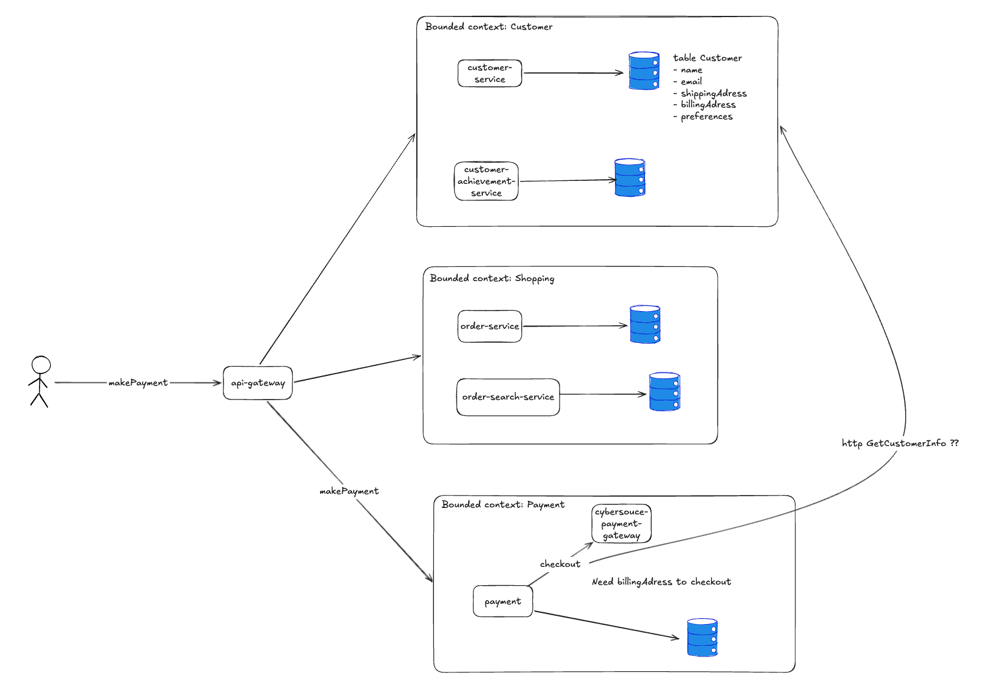
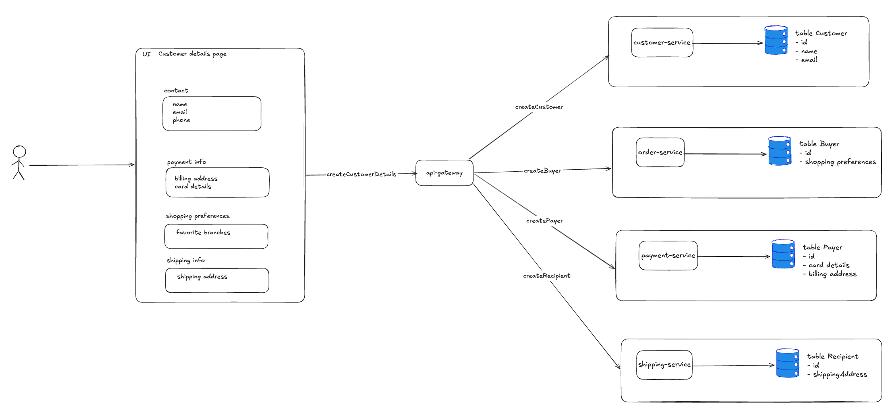

# Common Distributed System Design Pitfalls

## The Problem of Synchronously Calling Another Service to Get Data

### Context

A common design challenge is when a service needs data owned by another service to do its job. Consider an e-commerce example: the Payment service needs a customer's billing address to complete checkout, but that data is owned by the Customer service. What should we do?



The first obvious solution is to have Payment make a synchronous RPC call to Customer to retrieve the billing address. However, this approach raises a number of serious concerns.

#### 1. Wrong Domain Boundary

As Udi Dahan puts it in his distributed systems course:

> If a service needs to synchronously call another service to get data in order to do its job, that's usually a sign the boundaries are wrong — not a problem to be solved with a better RPC mechanism.

The first move should always be to challenge the requirement, not to satisfy it.

A service is a vertical slice that owns *all* the data and logic for a business capability. If Service A constantly needs Service B's data to make a decision, the behavior requiring that data may actually belong inside B — or the two may really be one service. The goal is autonomy: a service should be able to do its work even when every other service is down. A synchronous data dependency destroys that.

#### 2. Temporal Coupling

When Payment calls Customer, Customer must be reachable for the call to succeed. If Customer is unavailable, the call fails.

Synchronous services rely on other services to perform their work. Those services, in turn, have their own dependencies, which have their own dependencies. This chain creates excessive fan-out and makes it difficult to trace which service is responsible for each piece of business logic.

#### 3. Dependent Scaling

One of the most important attributes of a microservice is the ability to scale independently. With synchronous RPC, 1,000 requests to the Payment service generate 1,000 immediate requests to the Customer service.

Your ability to scale a service becomes constrained by the ability of all its dependencies to scale as well — directly tied to the degree of communication fan-out.

#### 4. Distributed Monolith

Services with many intertwining synchronous calls effectively behave as a distributed monolith. This pattern commonly emerges when teams decompose a monolith and use synchronous point-to-point calls to mirror the original internal boundaries.

In a monolith system, there is only one database — when Payment needs a billing address, it queries the Customer table directly. When teams decompose a monolith into microservices, they carry that same mental model: "I need data from Customer, so I'll just call it." A synchronous RPC call feels identical to a SQL query but this is not a microservice architecture at all.

#### 5. Violate AP preference in CAP Theorem

As Chris Richardson notes in *Microservices Patterns*, a system can only guarantee two of three properties: consistency, availability, and partition tolerance. Most architects today favor availability over consistency.

When Payment requires Customer to be available, it reduces Payment's own availability. If Customer is down, the Payment API fails too.

> If you want to maximize availability, you must minimize synchronous communication.

---

### Solution

To solve this, we need to ask: **why doesn't the Payment service own the billing address in the first place?**

It's natural to think of billing address as belonging to a "Customer." This leads to creating a single, all-encompassing Customer model:

```csharp
public class Customer {
    public Guid Id;
    public string Name;
    public string Email;
    public BillingAddress BillingAddress;
    public PaymentCards PaymentCards;
    public ShippingAddress ShippingAddress;
    public ShoppingPreferences Preferences;

    public void CreateContact() { }
    public void AddBillingAddress() { }
    public void AddPaymentCard() { }
    public void AddShippingInfo() { }
}
```

But in Domain-Driven Design, Eric Evans argues that creating one large model to satisfy every context is a design smell — which is why he introduced the concepts of **Bounded Context** and **Ubiquitous Language**.

The same person means different things in different contexts:
- In Customer Management: they are a **Customer**
- In Shopping: they are a **Buyer**
- In Payment: they are a **Payer**
- In Shipping: they are a **Recipient**

Each context owns different data and exposes different operations. Microsoft's architecture documentation covers this in depth: [Asynchronous microservice integration enforces microservice autonomy](https://learn.microsoft.com/en-us/dotnet/architecture/microservices/architect-microservice-container-applications/communication-in-microservice-architecture#asynchronous-microservice-integration-enforces-microservices-autonomy).

Instead of the god class above, model each context separately:

```csharp
// Customer context — identity and contact info only
public class Customer {
    public Guid Id;
    public string Name;
    public string Email;
    public string Phone;
}

// Shopping context — purchasing relating only
public class Buyer {
    public Id;
    public Identity CustomerId;
    public ShoppingPreferences Preferences;
}

// Payment context — billing and payment details only
public class Payer {
    public Guid Id;
    public Identity CustomerId;
    public BillingAddress BillingAddress;
    public List<PaymentCard> PaymentCards;
}

// Shipping context — delivery details only
public class Recipient {
    public Id;
    public Identity CustomerId;
    public ShippingAddress ShippingAddress;
}
```

Each model lives in its own bounded context and microservice.

**How are these models created?** The UI can call each service's API directly, or route through an API gateway.



With this design, Payment owns the `BillingAddress` — no synchronous RPC call required.

This is the cleanest solution to the problem.

---

### When Refactoring Is Too Costly: Alternative Techniques

#### Local Data Projection

If restructuring the system is too expensive, consider **Local Data Projection**. When a customer is created in the Customer service, the Payment service subscribes to the `CustomerCreated` event, extracts the billing address (and any other data it needs), and saves it to a local read model — for example, a `Payer` table.

With this approach, Payment can still operate even when the Customer service is down. Udi Dahan discusses this technique in his distributed systems course.

#### Separated Interface (for Stale Data)

One issue with local projection is that the read model data may be stale at the time of payment. For example, what if a customer updates their payment card in the Customer service mid-transaction?

Martin Fowler's **Separated Interface** pattern (from *Patterns of Enterprise Application Architecture*) addresses this. The service that needs the data (Payment) declares an interface:

```csharp
public interface INeedPaymentCardInfo {
    PaymentCardInfo GetPaymentCardInfo(Guid customerId);
}
```

This interface is published as a package (NuGet in .NET, a JAR in Java). The service that owns the data (Customer) implements the interface:

```csharp
public class CustomerPaymentInfoProvider : INeedPaymentCardInfo {
    public PaymentCardInfo GetPaymentCardInfo(Guid customerId) { ... }
}
```

Customer publishes its implementation as a separate package, which Payment imports and uses.

This resolves the stale data issue. It also means Payment only requires the Customer **database** to be available — not the Customer service itself — which is significantly more reliable.
